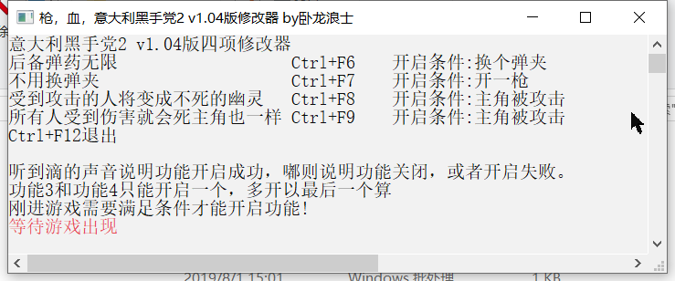
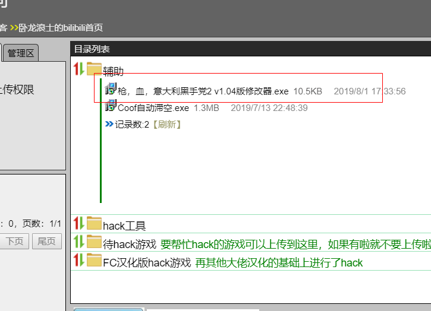

# 枪火意大利黑手党2 v1.04 修改器 
# Guns Gore Cannoli 2-cheart v1.04

    枪火意大利黑手党v1.04版本的游戏修改器
    对指定内存注入汇编代码，从而实现无限子弹不掉血等目的。
    代码对注入过程进行了简单的封装.
    对特征码搜索进行了缓存优化。缓存大小40kb,搜索速度为原来的10倍左右。
    当使用80kb缓存时速度仅从400ms提升至300ms左右。
    代码使用了3个线程，用于监控游戏状态和播放音乐。
    使用Visual Studio 2017 (v141)编译。其他版本也应该可以使用。
    

>http://pcup.xyz 下载成品。

    

